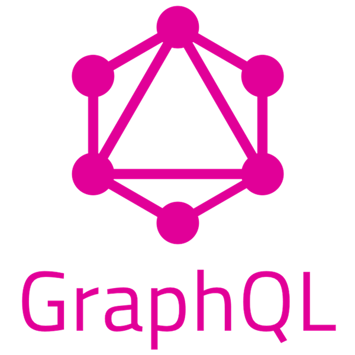

[](https://github.com/peterkuria/EcommerceVR)

- [Part 1: Virtual Reality Tour with React360](#a-name%22part1%22apart-1-virtual-reality-tour-with-react360)
  - [<a name="getting-started"></a>Getting Started](#a-name%22getting-started%22agetting-started)
    - [Tech Stacks](#tech-stacks)
- [<a name="adding-dependencies"></a>Setting up the Dev environment](#a-name%22adding-dependencies%22asetting-up-the-dev-environment)
  - [Steps to setup the environment](#steps-to-setup-the-environment)
  - [<a name="create-new-react360-project"></a>Create a new React360 Project](#a-name%22create-new-react360-project%22acreate-a-new-react360-project)
    - [version control set-up](#version-control-set-up)
  - [<a name="steps-to-setup-the-environment"></a>Steps to setup the environment](#a-name%22steps-to-setup-the-environment%22asteps-to-setup-the-environment)
- [Part 2: The Backend](#part-2-the-backend)
- [Part 3: Continuous Delivery and version control](#part-3-continuous-delivery-and-version-control)
- [Contributors](#contributors)

**[A React360 Virtual Reality, Graphql, Apollo, Microservices and Kubernetes](https://github.com/peterkuria/EcommerceVR)**

[Part 1: Virtual Reality Tour with React360](#part1)
## <a name="part1"></a>Part 1: Virtual Reality Tour with React360

### <a name="getting-started"></a>Getting Started

#### Tech Stacks
|React360|JavaScript|Django|GraphQL|Apollo|Python|
|:------:|:--------:|:----:|:-----:|:----:|:----:|
 |  |  |  |  |  |  |


<br> [Inspired by Facebook VR](https://facebook.github.io/react-360/docs/setup.html) <br>

This is a Virtual Reality experience created using the opensource Facebook's React360 library that makes use of [threejs](https://threejs.org).

In this awesome experience, I am going to create an amazing 360 and VR experience for the Facebook Developers Nairobi community and showcase the power of using Javascript to create VR experiences for Web and cross-platform devices augment the current virtual reality experiences of others such as [unity3d](https://unity.com), [HTC's Vive](https://www.vive.com/eu/product/vive-pro/), Samsung Oculus and many others.

I will be adding a backend api to act as a data store.
This repo will be continuously be updated and new technologies introduced with time, such as, using Docker our app to leverage the power micro-services and managing and scaling our apps with Kubernetes. We will eventually deploy and run this app on one of the popular cloud providers such as AWS, Azure of Google Cloud.

To get started with React360 this, hit on [Facebooks official React360 docs](https://facebook.github.io/react-360/docs/setup.html)

#### React360 in brief
1. You can use React to build VR web UIs
2. Render React Native components in 3D
3. Similar in Architecture to React Native
4. Uses Web Workers to avoid single-threaded computation limitation, which
could impact performance, break immersion

5. Can also load 3D models, using Entity (multiple formats)
// to reference a GLTF2 model

```javascript
<Entity source={{gltf2: asset('myModel.gltf')}} />
// to reference an untextured OBJ model
<Entity source={{obj: asset('myModel.obj')}} />
// to reference an OBJ with matching MTL file
<Entity source={{obj: asset('myModel.obj'), mtl: asset('myModel.mtl')}} />
```

An example of the React360 index entrypoint
```javascript
import React from 'react';
import {
  AppRegistry,
  StyleSheet,
  Text,
  View,
} from 'react-360';

export default class EcommerceVR extends React.Component {
  render() {
    return (
      <View style={styles.panel}>
        <View style={styles.greetingBox}>
          <Text style={styles.greeting}>
            Welcome to React 360
          </Text>
        </View>
      </View>
    );
  }
};

```

We will be mocking our database and later switch to either Express or Parse server/Django Graphql with API for our backend. See [Parse-server](https://github.com/parse-community/Parse-Server#getting-started)


## <a name="adding-dependencies"></a>Setting up the Dev environment

### Steps to setup the environment

* Make sure you've the following installed on your developement PC, Mac or Linux machine:

- Node
- NPM or yarn
- react-native
- react
- react-360-cli

 * You can install them by entering this on your terminal:

```sh
yarn add global react react-native react-360-cli
```


### <a name="create-new-react360-project"></a>Create a new React360 Project


[React360](https://github.com/facebook/react-360) use the [React-native](https://github.com/facebook/react-native)
$ mkdir EcommerceVR && cd EcommerceVR
$ echo "# EcommerceVR" >> README.md
$ react-360 init React360VRTour
$ cd React360VRTour

This project was bootstrapped with [Facebook's React360-cli docs](https://facebook.github.io/react-360)


#### The App has many levels:
Asteroids  - this app uses NASA API to render magnitude and miss distance of observed asteroids.


## Available Scripts

In the project directory, you can run:

### `yarn start`

Runs the app in the development mode.<br>
Open [http://localhost:8081](http://localhost:8081) to view it in the browser.

The page will reload if you make edits.<br>
You will also see any lint errors in the console.

### `yarn test`

Launches the test runner in the interactive watch mode.<br>
See the section about [running tests](https://github.com/facebook/react-native/wiki/Tests) for more information.

### `yarn run build`

Builds the app for production to the `build` folder.<br>
It correctly bundles React in production mode and optimizes the build for the best performance.

The build is minified and the filenames include the hashes.<br>
Your app is ready to be deployed!

See the section about [deployment](https://facebook.github.io/create-react-app/docs/deployment) for more information.


### Code Splitting

This section has moved here: https://facebook.github.io/create-react-app/docs/code-splitting

### Analyzing the Bundle Size

This section has moved here: https://facebook.github.io/create-react-app/docs/analyzing-the-bundle-size

### Making a Progressive Web App

This section has moved here: https://facebook.github.io/create-react-app/docs/making-a-progressive-web-app

### Advanced Configuration

This section has moved here: https://facebook.github.io/create-react-app/docs/advanced-configuration

### Deployment

This section has moved here: https://facebook.github.io/create-react-app/docs/deployment

### `npm run build` fails to minify

This section has moved here: https://facebook.github.io/create-react-app/docs/troubleshooting#npm-run-build-fails-to-minify


#### version control set-up


```bash
$ git init
$ git commit -m "first commit"
```

Open your cloud Git hoster and create a new empty repository, either Github.com, Bitbucket or Gitlab or any other cloud hosting platform. I chose to use Github and named my repo similar name as my current projects root directory, i.e EcommerceVR

``sh
# add your CI config
$ mkdir .circleci/config.yml


```bash
# open your root project directory
$ git remote add origin git@github.com:<your-github-username>/EcommerceVR.git
$ git push -u origin master
```

Move the index.html to ./Public folder and update imports on

### <a name="steps-to-setup-the-environment"></a>Steps to setup the environment

Add some Linting and testing for `code coverage`

We are going to us eslint-config-prettier as our linter and Prettier as our code formatter.

yarn add eslint-config-prettier prettier --save-dev

To use Eslint for linting:
$ yarn add eslint --save-dev


For prod we we be using the following:

```sh
#  yarn update webpack webpack-cli webpack-dev-server @babel/core @babel/preset-env esl
int-config-prettier puppeteer
```


Update your package.json to  include testing tools such as
In /src add the following test file

```javascript
import { configure } from 'enzyme'
import Adapter from 'enzyme-adapter-react-16'

configure({ adapter: new Adapter() });
```

To let jest watch our test edit our Package.json and add the following to the scripts object:
"lint": "eslint '**/*.js'",
"lint:fix": "prettier-eslint '**/*.js' --write",
"test": "jest --verbose",
"test:watch": "jest --watch --verbose",

npm run test:watch

To update testing snapshots update after making some additions to your code, run this:

```sh
npm test -- --u
```
## [Part 2: The Backend](#part2)

Now we can add a backend API or utilise one if we have it on our development stack. We can create a Django or this time we will go with an Express server.

To recreate this app from scratch


```sh
$ yarn init

package name: (EcommerceVR)

git add . && git commit -m "setup Express-Graphql server"
# To use cypress for testing on the web add it as:
# npm install cypress --save-dev
yarn add cypress --save-dev

```
[Cypress](https://github.com/cypress-io/cypress) is a useful tool for testing our applications.

# Create our fronted React Apollo App with create-react-app

```sh
npx create-react-app client
yarn
```

# To create the Express Graphql backend server:

#### Why Graphql?

Unlike REST API's all or nothing, Graphql query returns exactly what we ask
```sh
yarn init
yarn add graphql express-graphql express axios
# npm run server
yarn start server
# hit localhost:5000/graphql and make some queries

```
On the root of this folder create our `server.js` and `schema.js` for our launches/blog/ images Graphql object types file.
On the schema add your required object types, create a new object type for your particular object you want to make and endpoint call to the remote api. This can be a ImageType for Google poly API or RocketType to query SpaceX launches on their API.


## [Part 3: Continuous Delivery and version control](#part3)
We are going to use Docker containers for our application.

Create a bash script `test.sh`  to be used by our automating & CI testing pipeline [Travis CI](https://docs.travis-ci.com/user/docker/)

In the our root directory add the following file for CICD Pipeline.  Edit the file to have

```yaml
sudo: required

services:
  - docker

env:
  DOCKER_COMPOSE_VERSION: 1.24.1

before_install:
  - sudo rm /usr/local/bin/docker-compose
  - curl -L https://github.com/docker/compose/releases/download/${DOCKER_COMPOSE_VERSION}/docker-compose-`uname -s`-`uname -m` > docker-compose
  - chmod +x docker-compose
  - sudo mv docker-compose /usr/local/bin

before_script:
  - export REACT360_SERVICE_URL=http://127.0.0.1
  - yarn install

script:
  - bash test.sh

```

***To Get started with this project:***

clone this repository or create a new repository on the command line

```sh
git clone
``

## Bug which can be Encountered:
This is the most troublesome [[Workarounds] Packager unable to resolve module from /Users/node_modules/#4968](https://github.com/facebook/react-native/issues/4968) I faced and i was forced to restart the whole project again in a different directory.


Workarounds
Currently, the workarounds seem to be,

- Delete the node_modules folder - rm -rf node_modules && npm install
- Reset packager cache - rm -fr $TMPDIR/react-* or node_modules/react-native/packager/packager.sh --reset-cache
- Clear watchman watches - watchman watch-del-all
- Recreate the project from scratch
```

## Contributors

1. [Peter Kuria](https://github.com/peterkuria)

[EOF]